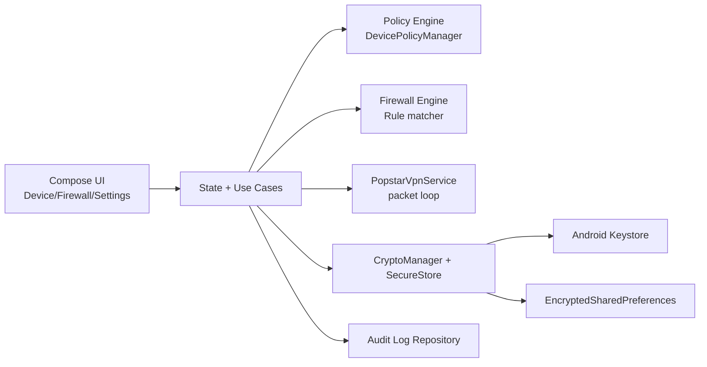

# High-level Architecture

Modules (logical in current codebase):
1. DPC / policy engine (`data/policy`, `admin`)
2. VPN / firewall (`vpn`, `data/firewall`)
3. UI layer (`ui`, `MainActivity`)
4. Persistence & encryption (`data/security`, model serialization)
5. Test layer (`src/test`, `src/androidTest`)
